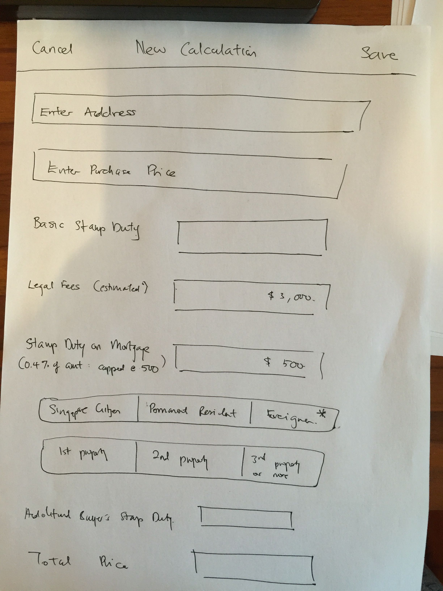
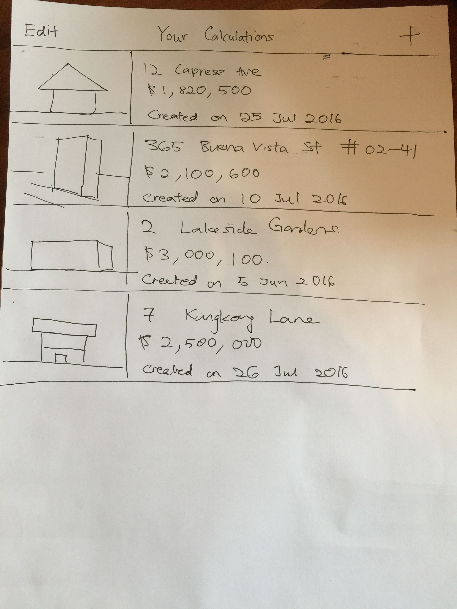
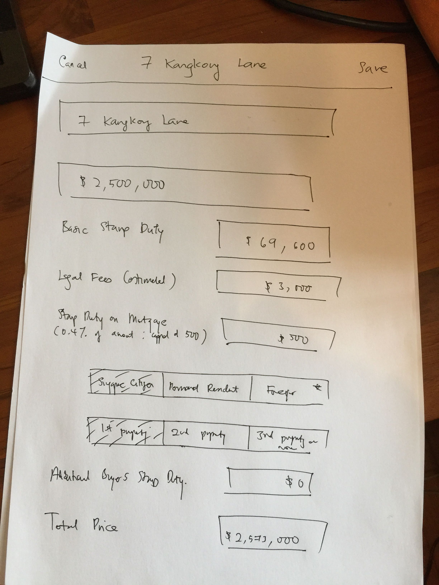

# ios-habit-project

## Table of Contents
  * [App Design](#app-design)
    * [Objective](#objective)
    * [Audience](#audience)
    * [Experience](#experience)
  * [Technical](#technical)
    * [Screens](#Screens)
    * [External services](#external-services)
    * [Views, View Controllers, and other Classes](#Views-View-Controllers-and-other-Classes)
  * [MVP Milestones](#mvp-milestones)
    * [Week 1](#week-1)
    * [Week 2](#week-2)
    * [Week 3](#week-3)
    * [Week 4](#week-4)
    * [Week 5](#week-5)
    * [Week 6](#week-6)

---

### App Design

#### Objective
Casacalc calculates the relevant stamp duty taxes you need to pay when buying your first, second or (lucky you!) third residential property in Singapore so that you will always be confident in knowing the total price you have to pay.

Enter the price you are paying to the seller. Select your tax residency status (Singapore Citizen, Permanent Resident, or foreigner) and Casacalc tells you how much you need to pay in stamp duty taxes. Save your calculations so that you can refer to them later. 

#### Audience
Any would-be home-buyer who needs to know how much will the new home actually end up costing him or her.

The demographic consists of first-time home-buyers who may be unfamiliar with stamp duty laws, families interested in purchasing a second property for investment reasons, as well as seasoned property investors. All three groups will benefit from knowing how much they will actually have to pay in stamp duty taxes. 

#### Experience
As a normal user, I want to be know the breakdown of additional fees that I need to pay in addition to the purchase price.

As a power user, I will shortlist several residential properties and save them so that I can refer to them later when comparing their final costs. I can also attach a photo of each property to better remember them.

Potential Feature - Export to email or other app.

#### List apps that are inspirational:

###### Competing Apps
- [UK] Stamp Duty Calculator (UK)
- [UK] Chesterton Stamp Duty Calculator
- SG Stamp Duty Calculator

[Back to top ^](#)

---

### Technical

#### Screens
* Main Screen (Listing the residential properties)

Clicking the "+" icon in the upper-right brings the user to the "Create" page

After creating a new property calculation, the user will be brought back to the Main Screen with the new calculation added.

Clicking on a calculation will bring the user to the respective page where the user can make any changes if necessary.

#### External services
* None at the moment

#### Views, View Controllers, and other Classes
* Views
  * CalcTableViewCell (each cell in the TableView)
* View Controllers
  * CalcTableViewController (to control the display of the MAIN page)
  * CalcViewController (the individual details page)
* Other Classes
  * [list any other classes you will need]

#### Data models
* Property.swift
- address
- purchase price
- basic stamp duty
- additional buyer's stamp duty
- photo

[Back to top ^](#)

---

### MVP Milestones
[The overall milestones of first usable build, core features, and polish are just suggestions, plan to finish earlier if possible. The last 20% of work tends to take about as much time as the first 80% so do not slack off on your milestones!]

#### Week 1
_planing your app_
* [goals for the week]

#### Week 2
_finishing a usable build_
* segues from the tableview to the details page and back again!

#### Week 3
* [goals for the week]

#### Week 4
* incorporate the calculator

#### Week 5
_starting the polish_
* Work on colour scheme
* Add the splash screen 

#### Week 6
_submitting to the App Store_
* Create the app icon
* Create the necessary screenshots
* Choose the keywords and do the write-up.

[Back to top ^](#)
